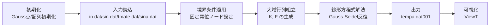
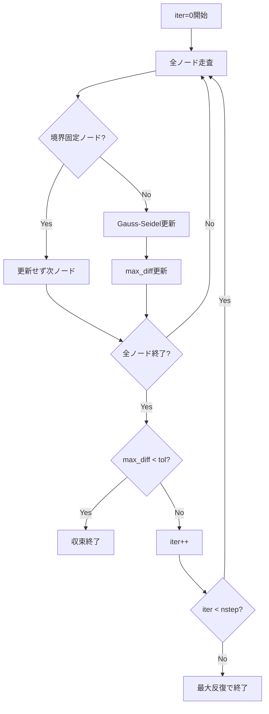

# Electrostatic FEM Solver 技術解説（A4想定）

## 概要
本資料は，本リポジトリの Electrostatic FEM Solver（四面体一次要素）について，**初期化 → 入力 → 行列組立 → 線形方程式解法 → 出力**の工程で整理し，データの流れ・計算の要点・再利用時のカスタマイズ指針をまとめた技術解説です。対象ケースは，例として **216節点・750要素，材料1に1.0V，境界20点に0.0V，等方導電率 σ=1.0，反復100回** を想定します。

---

## 1. 全体フェーズ



*図1（ダミーキャプション）：ソルバ全体フロー*

### 工程ごとの役割（実装対応）

| フェーズ | 主関数 | 役割 |
|---|---|---|
| 初期化 | `ElectrostaticAnalyzer::ElectrostaticAnalyzer` | 4点Gauss積分点を設定 |
| 入力 | `read_mesh`, `read_material_and_bc`, `read_initial_potential`, `read_analysis_config` | メッシュ/材料/境界/初期電位/反復条件を読込 |
| 行列組立 | `assemble_global_matrix` | 要素剛性 `Ke` を大域剛性 `K` と右辺 `F` に集約 |
| 線形解法 | `solve_linear_system` | Gauss-Seidel 反復で電位 `φ` を更新 |
| 出力 | `write_potential_distribution` | `tempa.dat001` 形式で節点電位を出力 |

---

## 2. 入力ファイルの役割と読み込み形式

### 2.1 `in.dat`（メッシュ）
- 1行目: `num_nodes num_elements dummy1 dummy2 unit`
- 続く `num_elements` 要素分: 1要素あたり4節点ID（四面体）
- 続く `num_nodes` 節点分: `x y z`

**役割**: 幾何（節点座標）と位相（要素接続）を定義。

### 2.2 `sin.dat`（材料・境界・電流源）
- ヘッダ: `ntblk ntmblk ntmate npt2 nlv`
- 境界条件 `ntblk` 行: `node1 node2 type value`
- 要素材質ブロック `ntmblk` 行: `start end mat`
- 材料物性 `ntmate` 行: `sx sy sz ro cv`（コード実装上）
- 電流源: `nqt`，続けて `nqt` 行 `elem ix iy iz`

**役割**: 導電率（σ）とDirichlet境界（固定電位），必要に応じた電流源を設定。

### 2.3 `tmate.dat`（初期電位）
- 1行目: 設定件数 `num_initial`
- 続く行: `mat_id value`

**役割**: 指定材質IDを持つ要素の節点へ初期電位を与える（反復初期値）。

### 2.4 `sina.dat`（解析条件）
- 1行目: フラグ7個
- 2行目: パラメータ7個（`params[0]` を `nstep` として使用）
- 3行目: `dt time0`
- 4行目: `freq`

**役割**: 主に反復回数 `nstep` を設定（例: 100回）。

---

## 3. 行列組立と反復求解アルゴリズム

### 3.1 大域剛性行列 `K` と右辺 `F` の組立
1. 各四面体要素の Jacobian `J`・`detJ` を計算
2. `invJ` で形状関数勾配を物理座標へ変換
3. 4点Gauss積分で局所剛性 `Ke += B^T D B detJ w`
4. 局所 `Ke` を節点対応で大域 `K` へ加算
5. 電流源を簡易に `F` へ分配（`volume/4`）

`D` は導電率テンソルだが，現実装は `sigma = mat.sx` を使うため，実質的に等方スカラー扱い（例: `σ=1.0`）。

### 3.2 Gauss-Seidel 法のポイント
- 反復式（自由ノード）
  \[
  \phi_i^{(k+1)} = \frac{1}{K_{ii}}\left(F_i - \sum_{j\neq i}K_{ij}\phi_j\right)
  \]
- 最大更新量 `max_diff` が `tol=1e-6` 未満で収束
- 上限反復数は `nstep`（例: 100）



*図2（ダミーキャプション）：Gauss-Seidel 反復処理*

---

## 4. 境界条件・固定電位ノードと自由ノード

- `sin.dat` の境界条件を `apply_boundary_conditions()` で適用
- `type=1` または `type=4` は `node1/node2` 両方を固定
- それ以外は `node1` のみ固定
- 固定ノードは反復更新せず，`fixed_value` を維持

**実務上の見方**
- 1.0V 側: 電位源（励振）ノード群（例: 材料1に属する領域）
- 0.0V 側: 引き出し/接地（シンク）ノード群（境界20点）

---

## 5. 可視化（ViewT）と物理解釈

- 出力 `tempa.dat001` は節点電位配列（6値/行）
- ViewT では，電位が高い領域ほど高輝度/暖色側，低い領域ほど低輝度/寒色側に対応（設定依存）
- 電位源ノードから接地ノードへ向かう等電位面・勾配が形成される

*図3（ダミーキャプション）：ViewTでの電位コンター表示イメージ*

---

## 6. 材料データ・境界条件が結果へ与える影響

| 設定 | 変更方向 | 物理結果への典型影響 |
|---|---|---|
| 導電率 `σ` | 増加 | 電位勾配が緩和されやすく，電流が流れやすい分布へ |
| 電位源ノード数/配置 | 局所化 | 局所高電位領域が強まり，勾配が急峻化 |
| 接地ノード（0V）配置 | 近接化 | 等電位面が詰まり，電界集中が起きやすい |
| 反復回数 `nstep` | 不足 | 未収束でノイズ的分布が残る可能性 |

---

## 7. 応用・再利用のためのカスタマイズ指針

1. **別案件メッシュ流用**: `in.dat` 差し替えで形状変更（節点ID整合を最優先）
2. **材料異方性対応**: 現状 `sx` のみ利用。異方性解析では `sy/sz` を組み込む実装拡張が有効
3. **境界条件拡張**: 固定電位以外（Neumann/Robin）を `F` 側へ追加
4. **求解器差し替え**: 大規模化時は SOR/CG/前処理付き反復法へ切替
5. **可視化連携**: `tempa.dat001` をVTK/CSV変換し，他可視化ツールに展開
6. **他物理への転用**: 行列構造が近い定常熱伝導・拡散方程式へ適用しやすい

---

## 8. 例題設定（本資料の前提）

- 節点数: 216
- 四面体要素数: 750
- 材料1側ノード群に 1.0V（電位源）
- 境界20点を 0.0V（接地）
- 導電率: 等方性 `σ=1.0`
- 反復: 100回
- 出力: `tempa.dat001`（ViewT可視化）

---

## 9. PDF化（A4）

本MarkdownはA4技術資料化を想定。例:

```bash
pandoc electrostatic_fem_solver_technical_guide.md -o electrostatic_fem_solver_technical_guide.pdf -V papersize:a4
```

